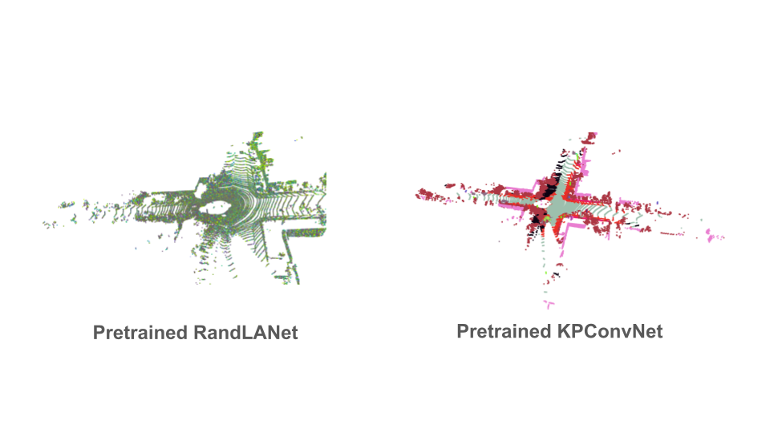

# Inference of Pretrained Models on Sample Point Cloud

[Open3D-ML](https://github.com/isl-org/Open3D-ML) is used to get pretrained models (over different datasets) and infer on sample point clouds. Unfortunately, not all pretrained models seems to work (especially RandLANet).




# Run inference of pretrained models on sample point cloud
```code
./run_segmentation.sh <point cloud.ply>

```


## Visualize point cloud as a video
```code
python pointcloud_visualizer_legend.py segmented_<name of dataset>_<name of architecture>.ply --json_path dic_<name of dataset>_<name of architecture>.json --video <name of dataset>_<name of architecture>.mp4 --frames 8 --fps 1 --zoom 6.0

```


## Comparison of Videos

```code
python compare_vid.py
```


[Results](assets/comparison_grid.mp4)
